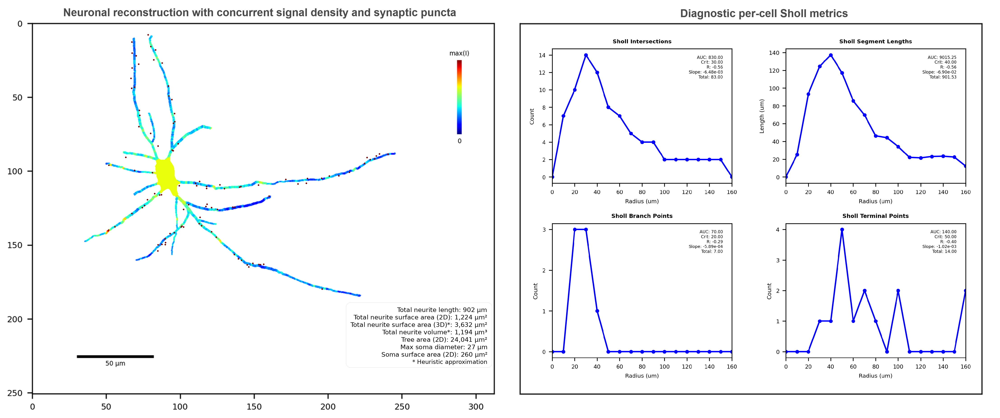

<p align="center">
  
</p>

<p align="center">
  <!-- Badges: update links as appropriate -->
  <a href="LICENSE"></a>
  <a href="https://doi.org/10.5281/zenodo.18553146"></a>
  <a href="https://www.protocols.io/"></a>
</p>

<p align="center">
  <a href="#features">Features</a> |
  <a href="#installation">Installation</a> |
  <a href="#usage">Usage</a> |
  <a href="#step-by-step-guide">Step-by-step guide</a> |
  <a href="#step-by-step-guide">Troubleshooting</a> |
  <a href="#example-dataset">Example dataset</a> |
  <a href="#contributing">Contributing</a> |
  <a href="#citation">Citation</a>
</p>

---

## Overview

<!-- Optional: add a graphical abstract / pipeline figure -->
<p align="center">
  
</p>

<strong>MorphoLogic extracts comprehensive neuronal morphometrics from 2D SWC reconstructions and can perform morphology-aware mapping to project concurrent microscopy signals or (synaptic) puncta onto reconstructed neurons.</strong>
Beyond standard geometric and Sholl-style outputs, MorphoLogic provides a framework for mapping image-derived measurements onto the reconstructed tree and associating them with low-level architecture, supporting morphology-conditioned summaries such as signal or puncta density versus distance from soma, neurite radius, branch order, or electrotonic distance.

<strong>Outputs include per-cell diagnostic visualizations and per-dataset aggregated CSV tables spanning segment-, neurite-, and cell-level summaries.</strong>
The exported tables are structured for downstream group comparisons and stratified statistical profiling, with measurements aggregated across bins of morphological features and both absolute and normalized positional coordinates, and can readily be used to isolate subsets such as the largest neurite in post-hoc analyses.

---

## Features

- SWC quality control
- Comprehensive morphometrics and Sholl analysis
- Morphology-aware mapping of image-derived measurements onto tree segments
- Morphology-conditioned aggregation for group comparison and stratified profiling
- Per-cell diagnostic visualizations
- GUI entrypoint 

<details>
  <summary><strong>Detailed feature list</strong></summary>

  - **SWC quality control**
    - Robust SWC parsing into a DataFrame (ID, Type, X, Y, Radius, Parent)
    - Validates numeric types (int-like IDs/Types/Parents; float coords/radii)
    - Checks topology (no dangling parents; ID > Parent for non-root nodes)
    - Enforces basic constraints (positive IDs; Parent != 0; non-negative radii)
    - Cleans reconstructions: merge pseudo-unique branch points; prune short terminal twigs
    - Removes nodes outside image bounds (and their descendants)
    - Collapses sub-threshold segments by rewiring, preserving critical nodes
    - Smooths radii along paths via sliding-window linear regression

  - **Comprehensive morphometrics and Sholl analysis**
    - Voxel-calibrated geometry (voxel_size in µm/px)
    - Customizable Sholl radius definition (start, stop, step in µm)
	  - Surface area and volume approximation with oblique frustums
    - Per-segment dependents: Neurite radius
    - Per-branch dependents: (electrotonic) length, surface area, volume
    - Per-neurite dependents: (electrotonic) length, surface area, volume
    - Per-cell dependents: primaries, total (electrotonic) lengths/areas/volumes, hull area, soma diameter/area
    - Sholl per-radius dependents: intersections, segment lengths, branch points, terminal points
    - Sholl per-subject dependents: AUC, critical radius, slope, r, total

  - **Morphology-aware mapping**
    - Channel-aware signal projection (configurable channels + channel names)
    - Customizable distance-gated assignment of puncta to soma/segments
    - Signal density normalization per unit membrane area
    - Optional assessment of somatic signal without nuclear contribution
    - Per-segment outputs: signal density per channel; puncta count per segment
    - Per-branch outputs: puncta count per branch
    - Per-neurite outputs: puncta count per neurite
    - Per-cell outputs: somatic signal density per channel; puncta summary counts

  - **Morphology-conditioned aggregation**
    - Streams per-cell cached outputs (PKLs) and concatenates across cells
    - Aggregates at multiple levels (segment, branch, neurite, cell; Sholl radius + per-subject)
    - User-defined grouping over folder “independents” (e.g., condition/batch/animal)
    - Binned summaries across morphology covariates (distance, radius, branch order, percent position)
    - Length-weighted averaging for segment-derived measures
    - Exports per-element tables and group summary stats (mean, SEM, count, quartiles)
    - Structured CSV outputs into consistent domain/subject/binned folders
    - Optional distribution-aligned normalization for signal-derived dependents

  - **Per-cell diagnostic visualizations**
    - Reconstruction overlays (soma + neurites) in micron coordinates
    - Geometry overlays colored by branch order, with optional metric annotation
    - Signal-density heatmaps per channel (auto-normalized to the cell’s max)
    - Puncta overlays with soma- vs neurite-assigned markers
    - Compact on-image legends (mode-specific) and configurable scale bars
    - Sholl 2×2 summary figure (intersections, lengths, branch points, terminals) with key stats

  - **GUI entrypoint**
    - Tkinter interface for configuring and running the pipeline
    - Tabbed editor for Pathing, Processing, Parameters, Visualization, and Aggregation
    - Browse-to-select data directory with inline help text for each field
    - Feature-aware controls (signal/puncta/aggregation tabs and fields enable/disable automatically)
    - Runs the pipeline in a background thread to keep the UI responsive
    - Progress bar and status updates with per-cell throughput reporting
    - Built-in validation and clear error dialogs for common failure modes

</details>

---

## Installation

### 1) Install Python

Download and install Python from the official website: https://www.python.org/downloads/  
*(Windows tip: During installation, make sure “Add Python to PATH” is checked.)*

After installation, open a **new** terminal (use for all commands below):

**Windows (PowerShell)**
- Press the **Windows** key, type **PowerShell**, and open **Windows PowerShell**.
  - Or press **Win + R**, type `powershell`, press **Enter**.
- Verify Python (expected: `Python 3.X.Y` where `X >= 10`):
  ```bash
  python --version
  ```

**Windows (Command Prompt)**
- Press the **Windows** key, type **Command Prompt**, and open it.
  - Or press **Win + R**, type `cmd`, press **Enter**.
- Verify Python (expected: `Python 3.X.Y` where `X >= 10`):
  ```bash
  python --version
  ```

**macOS**
- Open **Terminal**:
  - Press **⌘ + Space** to open Spotlight, type **Terminal**, press **Enter**.
- Verify Python (expected: `Python 3.X.Y` where `X >= 10`):
  ```bash
  python3 --version
  ```

**Linux**
- Open your terminal:
  - Often **Ctrl + Alt + T** works (Ubuntu and many distros).
  - Or open the application menu and search **Terminal**.
- Verify Python (expected: `Python 3.X.Y` where `X >= 10`):
  ```bash
  python3 --version
  ```

Help resources:

- https://docs.python.org/3/using/windows.html
- https://realpython.com/installing-python/

### 2) Clone Repository

Install Git (all platforms): https://git-scm.com/downloads

- Windows/macOS: download installer and run it (defaults are fine).
- Linux: prefer your package manager

(Optional) confirm Git is installed (expected output: `git version X.Y.Z`):
```bash
git --version
```

Clone the repository
```bash
git clone https://github.com/MaxLevianSterling/MorphoLogic.git
cd morphologic
```

### 3) Create Virtual Environment

macOS / Linux

```bash
python3 -m venv .venv
source .venv/bin/activate
```

Windows (PowerShell)

```bash
python -m venv .venv
..venv\Scripts\Activate.ps1
```

Windows (Command Prompt)

```bash
python -m venv .venv
..venv\Scripts\activate.bat
```

### 4) Install Dependencies

```bash
python -m pip install --upgrade pip
pip install -r requirements.txt
pip install -e .
```

## Usage

Launch the GUI (with the virtual environment activated):

```bash
python -m morphologic.gui
```

## Step-by-step guide

For a comprehensive guide on how to use MorphoLogic, including extensive troubleshooting, see:  

- **Protocols.io: REPLACE_WITH_LINK**

## Example dataset

To try MorphoLogic end-to-end, download the example dataset:

- **Zenodo DOI: https://doi.org/10.5281/zenodo.18553146**

Unzip the dataset locally and set **Data directory** to the extracted folder.

## Contributing

- **Report a bug / request a feature:** open an [issue](https://github.com/MaxLevianSterling/MorphoLogic/issues).  
  *(Tip: include a minimal reproducible example when possible.)*

- **Contribute code:**  
  1) Fork the repository  
  2) Create a feature branch  
  3) Make your changes 
  4) Open a [pull request](https://github.com/MaxLevianSterling/MorphoLogic/pulls) with a clear description of what changed and why

## Citation

If you use MorphoLogic in academic work, please cite:

Manuscript: REPLACE_WITH_PUBLICATION

DOI: REPLACE_WITH_DOI

## License

MorphoLogic is released under the GPL-3.0 license.

## Thanks to all contributors

Thanks to everyone who has helped improve MorphoLogic through code, discussions, bug reports, and feature requests.

Authors: Max L. Sterling, Sheersh Srivastava  
Contributors: https://github.com/MaxLevianSterling/MorphoLogic/graphs/contributors